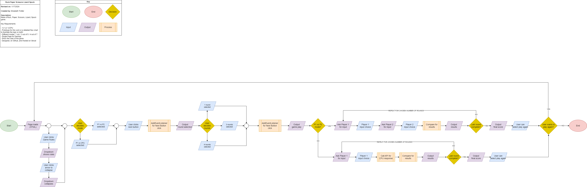

# Rock, Paper, Scissor, Lizard, Spock!

**Name:** Elizabeth Trotter

**Project Description:** Created a Rock, Paper, Scissors, Lizard, Spock game utilizing `JavaScript`.

Key requirements:
- PvP and PvCPU
- Different modes: 1 win / 3 out of 5 / 4 out of 7
- Single page HTML
- Show the rules of the game

## Peer Review
> **Name:** Brandon Nguyen Date/ Time: 1/19/24 1:43 pm
> 
> **Comment(s):** The design is very clean. Both the CPU and player vs player mode are functional. I think the patterns at the bottom and the solid icons are a nice addition as well. The only problem I can find is when I restart the game, the page takes a while to load up. Overall good job.

**Issues Resolved:**
- Added "Loading..." text to signify to user that the game is restaring and the restart click was confirmed :white_check_mark: *1/19/24 2:20 pm*

---

## Website Preview

Figure 1: Website game preview

## Flowchart

Figure 2: Flowchart of the logic prior to development

## Prototype

Click [Prototype V 1](https://www.figma.com/proto/kRB6CfbfABKfZ7iQk4eEnk/Rock-Paper-Scissors-Lizard-Spock?node-id=73-10&starting-point-node-id=73%3A10&mode=design&t=GtNA1yNpvZ9MCyWt-1) 
to visit the **rough draft Figma prototype design**. (Design currently in progress)
- *Notable features include game rules, hand icons, designed footer.*

---